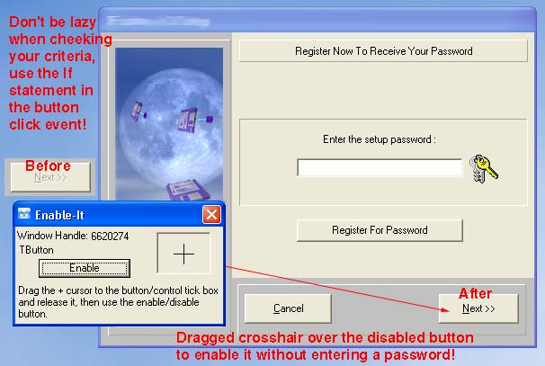



## Enable\-It

### Description

Enable It, enables or disables windows or objects in windows-applications, i.e. Buttons, tick boxes text boxes, … I used it to crack / unlock options in some Evaluation software I was testing, and also find some interesting weaknesses in a lot of registration or password protected installations, it works most of the time depending on the object type and underlying code, although this is not a crack, it demonstrates the EnableWindow API call, and teaches us to be careful when creating our installations.
 
### More Info
 
Be careful not to disable VB, windows desktop or anything to do with the application its self.

             |
---                |---
**Submitted On**   |2003-07-06 16:04:40
**By**             |[Peter Gransden](https://github.com/Planet-Source-Code/PSCIndex/blob/master/ByAuthor/peter-gransden.md)
**Level**          |Advanced
**User Rating**    |4.7 (56 globes from 12 users)
**Compatibility**  |VB 6\.0
**Category**       |[Windows API Call/ Explanation](https://github.com/Planet-Source-Code/PSCIndex/blob/master/ByCategory/windows-api-call-explanation__1-39.md)
**World**          |[Visual Basic](https://github.com/Planet-Source-Code/PSCIndex/blob/master/ByWorld/visual-basic.md)
**Archive File**   |[Enable\-It161057762003\.zip](https://github.com/Planet-Source-Code/peter-gransden-enable-it__1-46662/archive/master.zip)

### API Declarations

Enables or disables windows or objects in windows-applications using EnableWindow API

